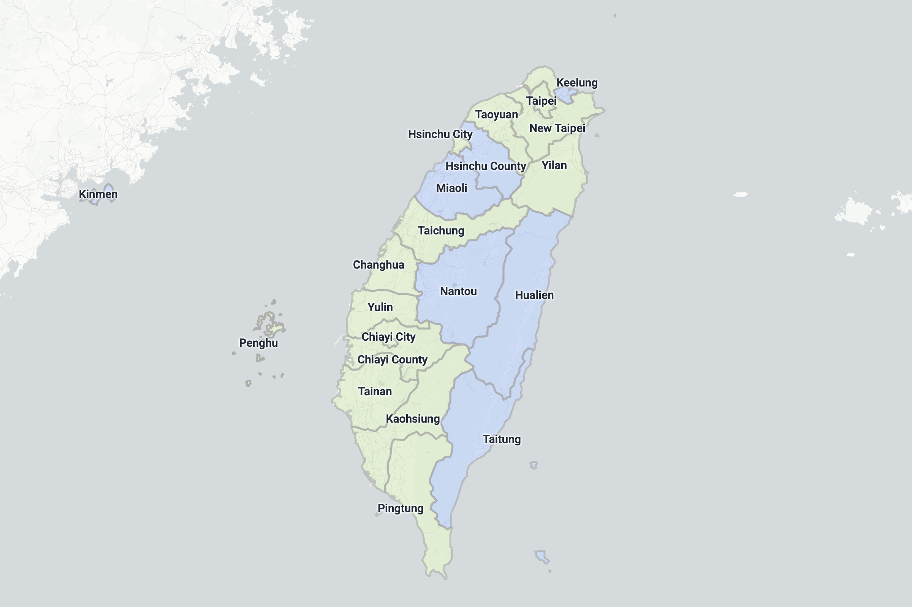

# Map Region

An interactive web tool for visualizing and styling geographic boundaries on a map — countries, states/provinces, and districts/counties.

Taiwan map created with Map Region.
The json file for this map can be found [here](demo/taiwan.json).

## Features

- **Shift + Hover** — Hold Shift to switch into subdivision mode and select states/provinces individually
- **Overlay Styling** — Customize the appearance of each region; Shift-click multiple layers to edit them together
- **Labels** — Add text labels to regions, or place free-standing labels anywhere on the map
- **Native Names** — Toggle between English and local-language region names
- **Export / Import** — Save your work to a file and reload it later

## Data Sources

| Level | Source |
|---|---|
| Admin0 (countries) | [world-atlas](https://github.com/topojson/world-atlas) — single TopoJSON file, loaded on page load |
| Admin1 (states/provinces) | [admin-boundaries](https://github.com/stephanietuerk/admin-boundaries) — GADM v3.6, lazy-loaded per country |
| Admin2 (districts/counties) | [admin-boundaries](https://github.com/stephanietuerk/admin-boundaries) — GADM v3.6, lazy-loaded per country |
